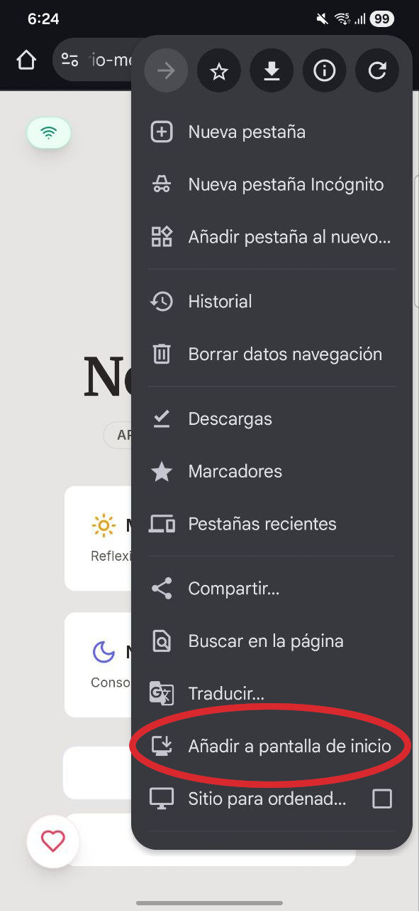
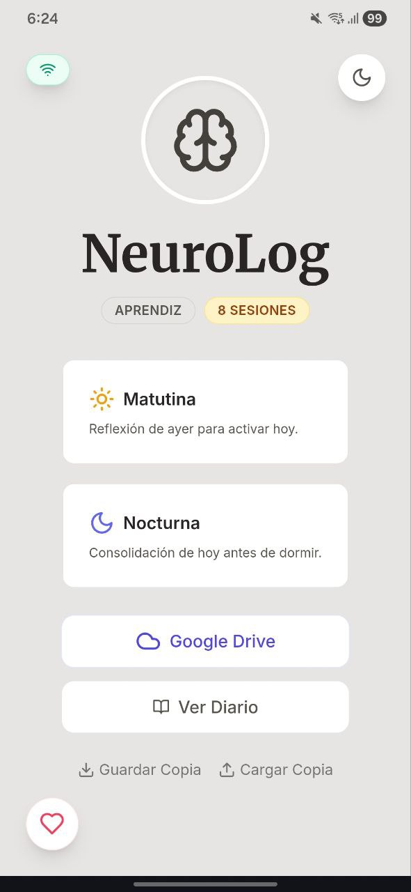

# 🧠 NeuroLog - Diario de Memoria & Gimnasio Mental / Memory Journal & Mental Gym

> **[English version below](#english-version)**

Una aplicación web diseñada científicamente para estimular la memoria episódica mediante ejercicios cognitivos intercalados y reflexión diaria. Construida con **Vanilla JavaScript** moderno para un rendimiento máximo.

**🌐 Web App:** [https://diario-mente.vercel.app/](https://diario-mente.vercel.app/)

---

## 📋 Descripción

**NeuroLog** no es solo un diario. Es una herramienta de **neuroeducación** que guía al usuario a través de una sesión de 15 minutos diseñada para fortalecer el hipocampo y la retención de memoria a largo plazo.

A diferencia de las aplicaciones pesadas basadas en frameworks complejos, NeuroLog utiliza la potencia nativa del navegador, ofreciendo una experiencia fluida, **offline-first** y totalmente responsiva.

### 🎯 Objetivo del Proyecto
Ayudar a las personas a combatir el "piloto automático" diario. Al obligar al cerebro a reconstruir los eventos del día (o del día anterior) en orden cronológico y espacial, se fortalecen las conexiones neuronales asociadas a la memoria episódica.

---

## 🚀 Características Principales

*   **Dos Modos de Sesión:**
    *   ☀️ **Matutina:** Activación cognitiva recordando el día de ayer (Recuperación diferida).
    *   🌙 **Nocturna:** Consolidación de memoria recordando el día actual antes de dormir.
*   **🧩 Ejercicios Cognitivos Intercalados:** Desafío de memoria de trabajo (memorizar y recuperar objetos) integrado en el flujo del diario.
*   **☁️ Sincronización en la Nube:** Integración real con **Google Drive** para guardar tu progreso sin servidores intermediarios.
*   **🔒 Privacidad Total:** Los datos viven en tu navegador o en tu Drive personal. No hay bases de datos externas.
*   **💾 Backup Local:** Importación y exportación de copias de seguridad en formato JSON.
*   **📅 Calendario y Estadísticas:** Visualización de rachas y revisión de entradas pasadas.
*   **🎨 UI/UX Moderna:** Diseño limpio, Modo Oscuro automático y transiciones suaves.
*   **📶 Modo Offline:** Funciona perfectamente sin internet gracias a su tecnología PWA.

---

## 📱 Guía de Instalación (PWA)

Puedes instalar NeuroLog en tu móvil para usarlo como una aplicación nativa, incluso sin internet.

1.  **Abre el navegador:** Ve a [https://diario-mente.vercel.app/](https://diario-mente.vercel.app/) y abre el menú de opciones.
2.  **Añadir a pantalla de inicio:** Selecciona la opción "Añadir a pantalla de inicio" o "Instalar aplicación".
3.  **Confirma la instalación:** Pulsa en "Instalar".
4.  **¡Listo!:** Ahora verás el icono de NeuroLog en tu menú de aplicaciones.

| Paso 1 | Paso 2 | Paso 3 |
| :---: | :---: | :---: |
|  |  |  |

---

## 🛠️ Tecnologías Utilizadas

*   **Core:** HTML5, CSS3, **Vanilla JavaScript (ES Modules)**.
*   **Estilos:** [Tailwind CSS](https://tailwindcss.com/).
*   **Build Tool:** [Vite](https://vitejs.dev/).
*   **Iconos:** [Lucide Icons](https://lucide.dev/).
*   **PWA:** Service Workers para soporte offline.

---

## 🔮 Roadmap y Siguientes Pasos

*   [x] Lógica base y almacenamiento local.
*   [x] Integración con Google Drive.
*   [x] **PWA (Progressive Web App):** Instalable y funcional offline.
*   [ ] **Selección de Idioma:** Opción para cambiar entre Español e Inglés dentro de la app.
*   [ ] **Integración con IA (Gemini/OpenAI):** Análisis semántico y feedback personalizado.
*   [ ] **Gamificación:** Sistema de niveles y medallas avanzado.

---

## ❤️ Apoya el Proyecto

---

# 🧠 NeuroLog - Memory Journal & Mental Gym

A scientifically designed web application to stimulate episodic memory through interleaved cognitive exercises and daily reflection. Built with modern **Vanilla JavaScript** for maximum performance.

**🌐 Web App:** [https://diario-mente.vercel.app/](https://diario-mente.vercel.app/)

---

## 📋 Description

**NeuroLog** is not just a journal. It is a **neuroeducation** tool that guides the user through a 15-minute session designed to strengthen the hippocampus and long-term memory retention.

Unlike heavy apps based on complex frameworks, NeuroLog uses the browser's native power, offering a smooth, **offline-first**, and fully responsive experience.

### 🎯 Project Goal
To help people combat daily "autopilot." By forcing the brain to reconstruct the day's events (or the previous day's) in chronological and spatial order, neural connections associated with episodic memory are strengthened.

---

## 🚀 Main Features

*   **Two Session Modes:**
    *   ☀️ **Morning:** Cognitive activation by remembering yesterday (Delayed recall).
    *   🌙 **Evening:** Memory consolidation by remembering the current day before sleep.
*   **🧩 Interleaved Cognitive Exercises:** Working memory challenge (memorizing and retrieving objects) integrated into the journal flow.
*   **☁️ Cloud Sync:** Real integration with **Google Drive** to save your progress without intermediary servers.
*   **🔒 Total Privacy:** Data lives in your browser or your personal Drive. No external databases.
*   **💾 Local Backup:** Import and export backups in JSON format.
*   **📅 Calendar and Stats:** Streak visualization and review of past entries.
*   **🎨 Modern UI/UX:** Clean design, automatic Dark Mode, and smooth transitions.
*   **📶 Offline Mode:** Works perfectly without internet thanks to PWA technology.

---

## 📱 Installation Guide (PWA)

You can install NeuroLog on your mobile to use it as a native app, even without internet.

1.  **Open Browser:** Go to [https://diario-mente.vercel.app/](https://diario-mente.vercel.app/) and open the options menu.
2.  **Add to Home Screen:** Select "Add to home screen" or "Install app".
3.  **Confirm Installation:** Tap "Install".
4.  **Done!:** You will now see the NeuroLog icon in your app menu.

| Step 1 | Step 2 | Step 3 |
| :---: | :---: | :---: |
|  |  |  |

---

## 🛠️ Technologies Used

*   **Core:** HTML5, CSS3, **Vanilla JavaScript (ES Modules)**.
*   **Styles:** [Tailwind CSS](https://tailwindcss.com/).
*   **Build Tool:** [Vite](https://vitejs.dev/).
*   **Icons:** [Lucide Icons](https://lucide.dev/).
*   **PWA:** Service Workers for offline support.

---

## 🔮 Roadmap and Next Steps

*   [x] Base logic and local storage.
*   [x] Google Drive integration.
*   [x] **PWA (Progressive Web App):** Installable and offline functional.
*   [ ] **Language Selection:** Option to switch between Spanish and English within the app.
*   [ ] **AI Integration (Gemini/OpenAI):** Semantic analysis and personalized feedback.
*   [ ] **Gamification:** Advanced level and badge system.

---

## ❤️ Support the Project

---

## 📄 License

This project is under the MIT License - see the [LICENSE.md](LICENSE.md) file for details.

---
*Developed with 🧠 by [Braulio](https://github.com/brauliofv)*